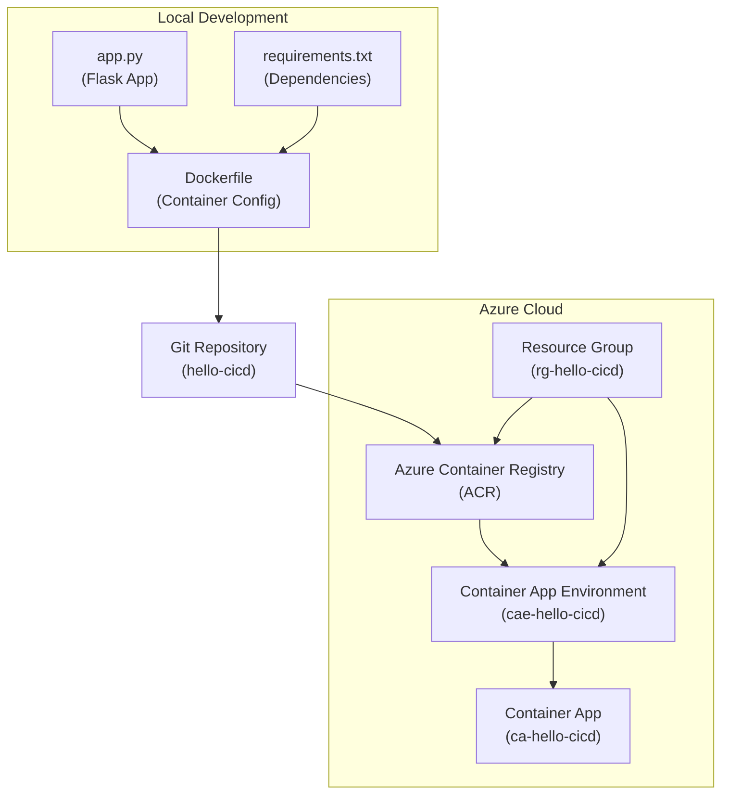
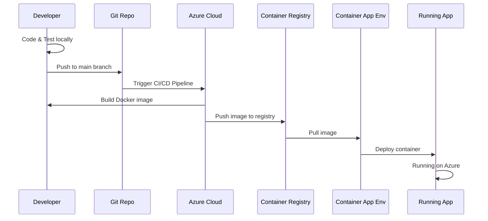

# HELLO-CICD Project Log

## Project Overview
A CI/CD pipeline project for deploying a Python Flask application to Azure Container Apps using Docker containerization.

---

## Project Architecture



---

## Steps Completed

### Step 1: Project Initialization ✅
**Date:** February 2, 2026

**What was done:**
- Created project structure with:
  - `app.py` - Flask application
  - `requirements.txt` - Python dependencies (flask, gunicorn)
  - `Dockerfile` - Container configuration

**Issues Fixed:**
- Removed erroneous `az logout` command from `requirements.txt`

**Current State:**
- Project files ready for containerization
- Dependencies: Flask, Gunicorn

---

### Step 2: Azure Authentication ✅
**Date:** February 2, 2026

**What was done:**
- Attempted initial Azure login with `az login`
- Initial subscription issue with `ludwigsevenheim@gmail.com`
- Tested alternative email: `03ludsev@gafe.molndal.se`
- Successfully authenticated with working Azure subscription

**Commands Used:**
```bash
az logout
az login
```

**Issue Resolution:**
- First email had no active subscriptions
- Successfully logged in with valid subscription account

---

### Step 3: Azure Infrastructure Setup ✅
**Date:** February 2, 2026

**What was done:**
- Created Resource Group: `rg-hello-cicd` in `swedencentral` region
- Created Container App Environment: `cae-hello-cicd`
- Prepared configuration for Container Registry and Container App

**Commands Used:**
```bash
az group create \
  --name rg-hello-cicd \
  --location swedencentral

az containerapp env create \
  --name cae-hello-cicd \
  --resource-group rg-hello-cicd \
  --location swedencentral
```

**Resources Created:**
- ✅ Resource Group: `rg-hello-cicd`
- ✅ Container App Environment: `cae-hello-cicd`

---

### Step 4: Configuration Management ✅
**Date:** February 2-3, 2026

**What was done:**
- Created `.azure-config` file to store resource names
- Centralized configuration for reuse across deployment scripts

**File: `.azure-config`**
```bash
RESOURCE_GROUP=rg-hello-cicd
ACR_NAME=acrhellopicd${SUFFIX}
LOCATION=swedencentral
CONTAINER_APP=ca-hello-cicd
```

**Usage:**
```bash
source .azure-config
```

---

## Deployment Pipeline Workflow



---

## Current Project Status

### ✅ Completed
- [x] Local project structure created
- [x] Python Flask app with dependencies
- [x] Dockerfile for containerization
- [x] Azure account authentication
- [x] Resource Group created
- [x] Container App Environment created
- [x] Configuration file setup

### ⏳ Next Steps
- [ ] Create Azure Container Registry (ACR)
- [ ] Build and push Docker image to ACR
- [ ] Deploy Container App
- [ ] Set up CI/CD pipeline (GitHub Actions or Azure Pipelines)
- [ ] Test application deployment
- [ ] Configure custom domain (optional)
- [ ] Set up monitoring and logging

---

## Project Files Structure

```
Hello-CICD/
├── app.py                 # Flask application
├── requirements.txt       # Python dependencies
├── Dockerfile            # Container configuration
├── .azure-config         # Azure resource configuration
├── PROJECT_LOG.md        # This file
└── .git/                 # Git repository
```

---

## Azure Resources Created

| Resource | Name | Region | Status |
|----------|------|--------|--------|
| Resource Group | `rg-hello-cicd` | Sweden Central | ✅ Created |
| Container App Environment | `cae-hello-cicd` | Sweden Central | ✅ Created |
| Container Registry | `acrhellopicd${SUFFIX}` | - | ⏳ Pending |
| Container App | `ca-hello-cicd` | - | ⏳ Pending |

---

## Key Commands Reference

### Azure CLI Commands
```bash
# Authentication
az login
az logout
az account show

# Resource Group
az group create --name rg-hello-cicd --location swedencentral
az group list

# Container App Environment
az containerapp env create --name cae-hello-cicd --resource-group rg-hello-cicd --location swedencentral

# Load configuration
source .azure-config
```

### Docker Commands (Next Steps)
```bash
# Build image
docker build -t hello-cicd:latest .

# Push to ACR
az acr build --registry ${ACR_NAME} --image hello-cicd:latest .
```

---

## Troubleshooting Log

| Issue | Solution | Status |
|-------|----------|--------|
| `Please run 'az login' to setup account` | Executed `az login` with valid subscription | ✅ Resolved |
| `No subscriptions in Standardkatalog` | Used email with active Azure subscription | ✅ Resolved |
| Invalid content in `requirements.txt` | Removed `az logout` command | ✅ Resolved |

---

## Notes & Observations

- **Region:** Sweden Central chosen for GDPR compliance and data residency
- **Container Platform:** Azure Container Apps selected for simplified management
- **Configuration Management:** Environment variables stored in `.azure-config` for consistency
- **Next Focus:** Container Registry setup and Docker image deployment

---

## Contact & References

- **Project Repository:** https://github.com/ludwigsevenheim-alt/hello-cicd
- **Azure Documentation:** https://docs.microsoft.com/azure/
- **Docker Documentation:** https://docs.docker.com/

---

*Last Updated: February 3, 2026*
*Project Status: In Progress - Infrastructure Setup Phase*
